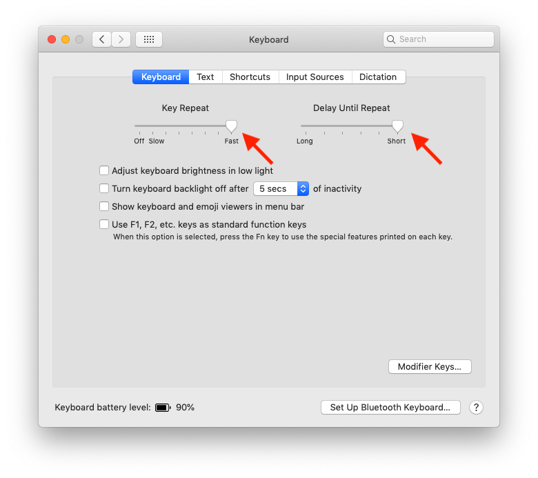

# Setup instructions for React with macOS

The following instructions will help you to get ready for [ReactJS academy bootcamp](https://reactjs.academy/):

- Install a package manager
- Install the text editor used by ReactJS developers
- Install `NodeJS` and `create-react-app`
- Pimp your Terminal
- Up-to-date browser with React Developer Tools: [Chrome](https://chrome.google.com/webstore/detail/react-developer-tools/fmkadmapgofadopljbjfkapdkoienihi?hl=en) or [Firefox](https://addons.mozilla.org/en-US/firefox/addon/react-devtools/)

## Microsoft Visual Studio Code

You can use the editor of your choice but all the coaches are using VSCode.

Install it with `brew` or [download it manually on the official website](https://code.visualstudio.com/download)

```console
$ brew cask install visual-studio-code
```

Inside VSCode, press `⌘`+`P`, and enter:

```
ext install vscode-language-babel
```

Congratulations! You can install your first extention, it should be the top result.

## Install a Node Version Manager

https://github.com/creationix/nvm

```console
curl -o- https://raw.githubusercontent.com/creationix/nvm/v0.34.0/install.sh | bash
```

## Pimp your terminal


```console
npm install -g spaceship-prompt
```

Done. This command should link `spaceship.zsh` as `prompt_spaceship_setup` to your `$fpath` and set `prompt spaceship` in `.zshrc`. Just reload your terminal.

## First class citizen Keyboard

### Speed

__ > _System Preferences_ > _Keyboard_ > **Keyboard**

Set `Key Repeat` to fast and `Delay Until Repeat` to short.



### Full control

__ > _System Preferences_ > _Keyboard_ > **Shortcuts**

Set the radio button to `All controls`.


When you get a dialog you can:

- `Enter` to confirm
- `Space` to cancel
- `Tab` to select your option

## We want to know you!

Would mind please to add a picture to your Slack Profile? Or better create a gravatar profile to sync-up all your picture accross the internet with your best selfie 🤳

https://gravatar.com/

It’ll help the coaches to remember the names. We are a few coaches and we’d love to remember all your names 😉

---

Happy hacking!
